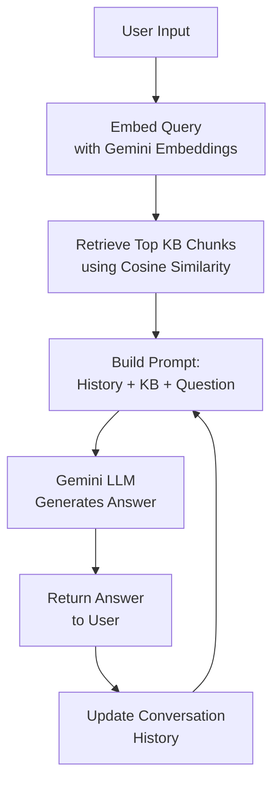

# Glucose Agentic AI

This project is an agentic AI assistant demo for the Glucose product, designed to answer user questions using a knowledge base and Gemini AI API. It features multi-turn memory for natural, context-aware conversations.

## Features
- Retrieval-Augmented Generation (RAG) pipeline
- Gemini Embeddings for semantic search
- Gemini LLM for answer generation
- Multi-turn conversational memory
- Agentic prompt engineering for clarification and grounding

## Setup
1. **Install dependencies:**
   ```sh
   pip install -r requirements.txt
   ```
2. **Get a Gemini API key:**
   - Visit [Google AI Studio](https://aistudio.google.com/app/apikey) and generate an API key and place it in `agentic_answer.py`.
3. **Prepare the knowledge base:**
   - Ensure `glucose_knowledge_base.json` is present and structured.
   - The present knowledge base which is available in glucose_knowledge_base.txt was scraped from https://www.five-whys.com/glucose and then generated as embeddings.
   - Run `embed_kb.py` to generate `glucose_kb_embeddings.json`.
4. **Run the agent:**
   ```sh
   python agentic_answer.py
   ```

## Usage
- Start the agent and ask questions about the Glucose product.
- The agent will clarify incomplete or ambiguous questions and only answer using the knowledge base.
- Multi-turn memory allows for follow-up questions and context retention.

## Technical Explanation
This agent uses a Retrieval-Augmented Generation (RAG) pipeline:
1. **User Input:** The user asks a question.
2. **Embedding:** The question is embedded using Gemini Embeddings.
3. **Retrieval:** The most relevant knowledge base chunks are retrieved using cosine similarity.
4. **Prompt Construction:** The agent builds a prompt including the conversation history, retrieved knowledge, and the user question.
5. **LLM Generation:** The prompt is sent to Gemini LLM, which generates a grounded, structured answer or asks for clarification.
6. **Multi-Turn Memory:** The last 5 exchanges are included in the prompt for context.

## Technical Diagram

